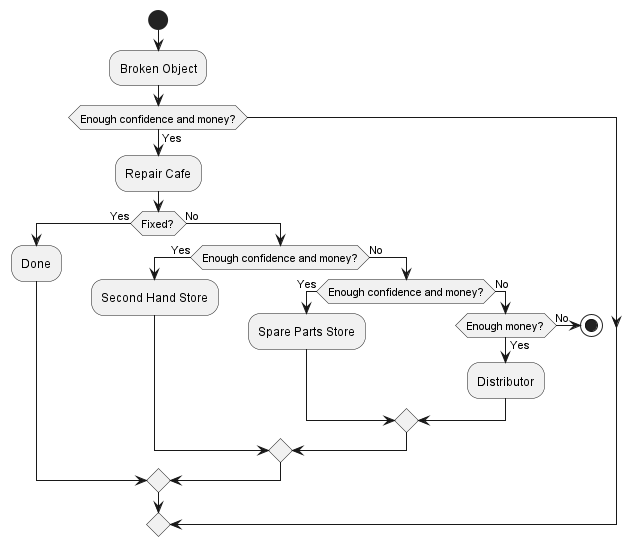

# Circular Economy

Case study in agent-oriented programming.

[Full subject here](https://github.com/EmmanuelADAM/jade/tree/english/issia23).

## Model

#### ProductType

La classe ProductType représente un type de produit.

Variables :

- `nbParts` : le nombre de pièces que contient le produit ;
- `standPrice` : le prix standard de la pièce.


### Agents

<!--
```
@startuml class

class User {
    Product[] products
    int skill
    int money
    int time
}

class RepairCafe {
    int cost
}

class SparePartsStore {
    int stock
    Part part ?
    int cost
}

class SecondHandStore {
    int stock
    Part part ?
    int cost
}

class Distributor {
    int cost
}

interface Product {
    float price
    Part[] parts
}
interface Part {
    
}

class Mouse {
    
}
enum MousePart {
    
}

class Screen {
    
}
enum ScreenPart {
    
}

class CoffeeMachine {
    
}
enum CoffeeMachinePart {
    
}

class WashingMachine {
    
}
enum WashingMachinePart {
    
}

class Dishwasher {
    
}
enum DishwasherPart {
    
}

class VacuumCleaner {
    
}
enum VacuumCleanerPart {
    
}

Product <|.r. Mouse : Implements
Product <|.r. Screen : Implements
Product <|.r. CoffeeMachine : Implements
Product <|.r. WashingMachine : Implements
Product <|.r. Dishwasher : Implements
Product <|.r. VacuumCleaner : Implements

Part <|.r. MousePart
Part <|.r. ScreenPart
Part <|.r. CoffeeMachinePart
Part <|.r. WashingMachinePart
Part <|.r. DishwasherPart
Part <|.r. VacuumCleanerPart


Product *-- "1..4" Part
User o-- "1..n" Product

User -> RepairCafe : visits
User -> SparePartsStore : visits
User -> SecondHandStore : visits
User -> Distributor : visits

@enduml```
-->


---

<!--
```
@startuml sequence

start

:Broken Object;

if (Enough confidence and money?) then (Yes)
    :Repair Cafe;
    if (Fixed?) then (Yes)
        :Done;
else (No)
if (Enough confidence and money?) then (Yes)
    :Second Hand Store;
else (No)
if (Enough confidence and money?) then (Yes)
    :Spare Parts Store;
else (No)
if (Enough money?) then (Yes)
    :Distributor;
else (No)
    stop

@enduml```
-->

<!--
```
@startuml activity

start

:Broken Object;

if (Enough Confidence and Money?) then (Yes)
    :Repair Cafe;
    :Done;
else

:A;

if (Enough confidence and money?) then (Yes)
    :Repair Cafe;
elseif (Enough confidence and money?) then (Yes)
    :Second Hand Store;
elseif (Enough confidence and money?) then (Yes)
    :Spare Parts Store;
elseif (Enough money?) then (Yes)
    :Distributor;
else (No)
    :Done;
endif

stop

@enduml```
-->


<!--
```
@startuml main
title Main Process

(*) -> "Breakdown"
if "User has knowledge?" then
    -> [yes] "Repair check"
    if "Is repairable?" then
        -> [yes] "Look for needed part"
    endif
else
    -> [no] "CFP repair cafe for advice"
endif

"CFP repair cafe for advice" -> "Repair check"

@enduml```
-->

<!--
```
@startuml breakdown
title Activity diagram\nDealing with a breakdown

start
:Breakdown;
note left
    User has a __time limit__, 
    but __no budget limit__. 
    They always choose the 
    cheapest option until 
    they run out of time.
end note

if (User has knowledge?) then (yes)
else (no)
    group #lightYellow "Seeking advice" {
        :CFP repair cafe for advice; <<procedure>>
        if (Out of time?) then (yes)
            #pink:(D)
        else (no)
        endif
    }
endif

if (Is repairable?) then (yes)
else (no)
    #pink:(D)
endif

group #lightGreen "Seeking replacement part" {
    :CFP part stores for needed part; <<procedure>>
    if (Out of time?) then (yes)
        #pink:(D)
    else (no)
    endif
    if (Part found?) then (yes)
    else (no)
        #pink:(D)
    endif
}

if (Can user repair?) then (yes)
else (no)
    :CFP repair cafe for repair help; <<procedure>>
    note left
        User can't run 
        out of time here.
    end note
endif
stop

group #lightCoral "Replacing the product" {
    #pink:(D)
    :CFP distributors for new product; <<procedure>>
    stop
}
floating note
    When unable to repair
    the product or frustrated
    with the wait, users seek
    to buy a new one.
end note

@enduml```
-->


