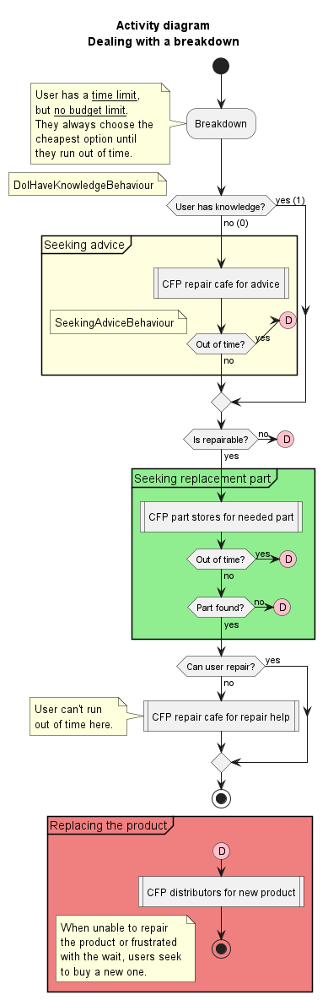

# Circular Economy

Case study in agent-oriented programming.

[Full subject here](https://github.com/EmmanuelADAM/jade/tree/english/issia23).

> Antoine AGRÉ, FISE 5A ICy

## Contexte

Ce projet utilise le framework JADE, en particulier le projet JadeUPHF, pour modéliser et simuler une économie circulaire.

On modélise des utilisateurs possédant des produits, et le processus qu'ils suivent lorsqu'un dysfonctionnement apparaît.

Un outil central dans cette modélisation est le CFP (Call For Project), qui est utilisé par les utilisateurs pour représenter une recherche de produit ou de service parmi un type de magasin.

## Programme

La classe `Main` est le point d'entrée du programme : elle crée les produits de référence et initialise la simulation.

Le package `agents` contient les classes définissant les agents : 

- `UserAgent` : un utilisateur ;
- `RepairCafeAgent` : un repair café ;
- `SparePartStoreAgent` : une boutique de pièces détachées (pas encore utilisé).

Le package `behaviours` contient les comportements utilisés par les agents :

- `BreakdownFSMBehaviour` : le comportement que suit un utilisateur en réaction à une panne, suivant une machine à états finis ;
- `DoIHaveKnowledgeBehaviour` : représente un nœud de choix dans la modélisation en FSM, vérifiant si l'utilisateur a des connaissances suffisantes pour savoir quelle pièce acheter ;
- `SeekingAdviceBehaviour` : comportement ContractNetInitiator, utilisé pour demander un RDV aux repair cafés pouvoir connaître la pièce à acheter.

Le package `gui` contient `UserAgentWindow`, [adaptée du projet d'Emmanuel Adam](https://github.com/EmmanuelADAM/jade/blob/english/handsOn/circularEconomy/gui/UserAgentWindow.java), qui ajoute une interface de sélection de produit pour les utilisateurs.

Enfin, le package `models` contient les classes modélisant les éléments de la simulation : `Part`, `Product`, et `ProductType`.

## Diagrammes

### Diagramme de classes

Diagramme réalisé au début du projet, montrant les différentes classes utilisées. Certains éléments ne sont plus à jour.

<!--
```
@startuml class

class User {
    Product[] products
    int skill
    int money
    int time
}

class RepairCafe {
    int cost
}

class SparePartsStore {
    int stock
    Part part ?
    int cost
}

class SecondHandStore {
    int stock
    Part part ?
    int cost
}

class Distributor {
    int cost
}

interface Product {
    float price
    Part[] parts
}
interface Part {
    
}

class Mouse {
    
}
enum MousePart {
    
}

class Screen {
    
}
enum ScreenPart {
    
}

class CoffeeMachine {
    
}
enum CoffeeMachinePart {
    
}

class WashingMachine {
    
}
enum WashingMachinePart {
    
}

class Dishwasher {
    
}
enum DishwasherPart {
    
}

class VacuumCleaner {
    
}
enum VacuumCleanerPart {
    
}

Product <|.r. Mouse : Implements
Product <|.r. Screen : Implements
Product <|.r. CoffeeMachine : Implements
Product <|.r. WashingMachine : Implements
Product <|.r. Dishwasher : Implements
Product <|.r. VacuumCleaner : Implements

Part <|.r. MousePart
Part <|.r. ScreenPart
Part <|.r. CoffeeMachinePart
Part <|.r. WashingMachinePart
Part <|.r. DishwasherPart
Part <|.r. VacuumCleanerPart


Product *-- "1..4" Part
User o-- "1..n" Product

User -> RepairCafe : visits
User -> SparePartsStore : visits
User -> SecondHandStore : visits
User -> Distributor : visits

@enduml```
-->


---

### Diagramme d'activité

Ce diagramme est le centre du projet, et représente le cheminement d'un utilisateur confronté à une panne.

Pour l'instant, seule la partie correspondant à "Seeking Advice" est implémentée (jusqu'au nœud précédant "Is repairable?").

Ce diagramme est implémenté par `BreakdownFSMBehaviour`, qui est donc une machine à états finis.

Dans la partie déjà implémentée par exemple, l'utilisateur va vérifier si son niveau de connaissances lui permet de savoir quelle pièce remplacer. Si le niveau est trop bas, il entre dans le `SeekingAdviceBehaviour`, et cherche à établir un rendez-vous avec un repair café pour y demander conseil. Si le niveau est suffisant, l'utilisateur n'a pas besoin de cette étape.

<!--
```
@startuml breakdown
title Activity diagram\nDealing with a breakdown

start
:Breakdown;
note left
    User has a __time limit__, 
    but __no budget limit__. 
    They always choose the 
    cheapest option until 
    they run out of time.
end note


if (User has knowledge?) then (yes (1))
else (no (0))
    group #lightYellow "Seeking advice" {
        :CFP repair cafe for advice; <<procedure>>
        if (Out of time?) then (yes)
            #pink:(D)
        else (no)
        endif
    }
    note left: SeekingAdviceBehaviour
endif
note left
    DoIHaveKnowledgeBehaviour
end note

if (Is repairable?) then (yes)
else (no)
    #pink:(D)
endif

group #lightGreen "Seeking replacement part" {
    :CFP part stores for needed part; <<procedure>>
    if (Out of time?) then (yes)
        #pink:(D)
    else (no)
    endif
    if (Part found?) then (yes)
    else (no)
        #pink:(D)
    endif
}

if (Can user repair?) then (yes)
else (no)
    :CFP repair cafe for repair help; <<procedure>>
    note left
        User can't run 
        out of time here.
    end note
endif
stop

group #lightCoral "Replacing the product" {
    #pink:(D)
    :CFP distributors for new product; <<procedure>>
    stop
}
floating note
    When unable to repair
    the product or frustrated
    with the wait, users seek
    to buy a new one.
end note

@enduml```
-->



## Retour d'expérience

Je n'avais jamais rencontré la programmation orientée agents avant ce module, et je l'ai trouvé agréable à appréhender et à utiliser.

Le point le plus difficile a été la prise en main du framework et de sa logique. La modélisation du problème a souvent été remise en cause, et les classes ont été modifiées de nombreuses fois. Mais une fois cette phase initiale dépassée, son utilisation est assez agréable et naturelle.

`SeekingAdviceBehaviour` a longtemps été une classe dérivée de `AchieveREInitiator`, qui n'était finalement pas adaptée à cette situation puisqu'elle modélise une demande de réalisation d'une action. Le comportement dérive finalement de `ContractNetInitiator`, qui est plus approprié.

J'aurais aimé pouvoir implémenter le reste du diagramme d'activité présenté plus haut, et avoir une idée plus claire du problème au départ pour le modéliser plus clairement.